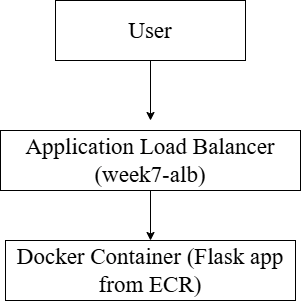
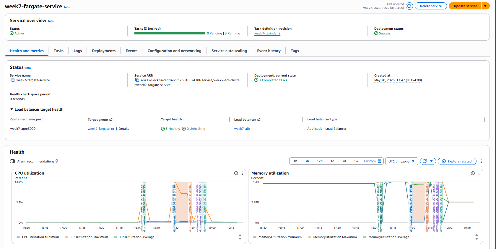
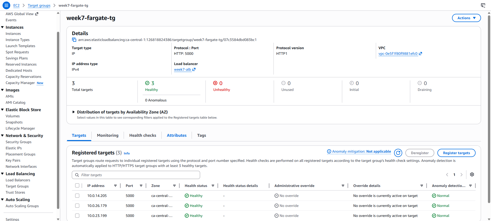
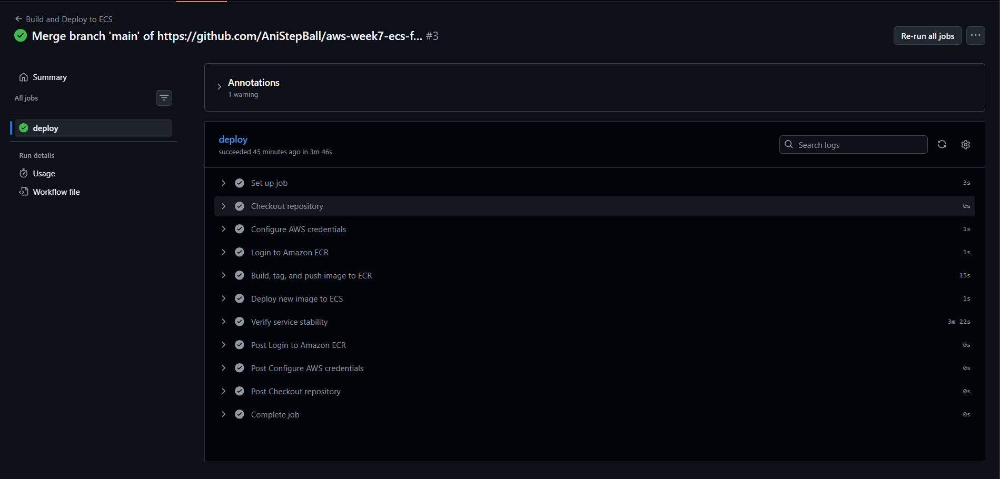
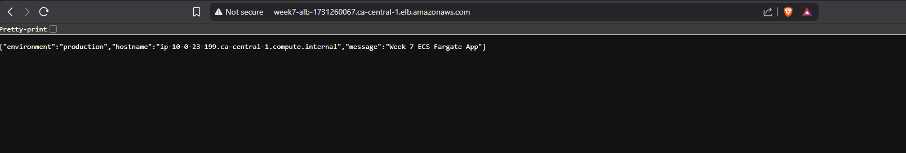

# AWS Week 7: ECS Fargate CI/CD Deployment

## About
This project deploys a Dockerized Flask application to AWS ECS Fargate using ECR for image storaging, an Application Load Balancer (ALB) for traffic rotuting and GitHub Actions for automated CI/CD

---

## Objective
To move from manually running containers on EC2 to managing a container using ECS Fargate, in which there is no servers to manage and no SSH needed.

---

## Architecture



---

## CI/CD Flow

### CI/CD Flow Chart


| Step | Tool | What Happens |
|---|---|---|
| Code Push | GitHub | Triggers Actions workflow |
| Build Image | Docker | Image tagged with commit SHA |
| Push image | Amazon ECR | Private registry stoires the image |
| Deploy | ECS update-service | Forces new task deployment |
| Verify | AWS ECS Wait | Confirms all tasks healthy before success |

---

## Security Model

| Layer | Rule |
|---|---|
| ALB SG | Accepts HTTP port 80 from internet |
| ECS Task SG | Accepts port 5000 from ALB SG only |
| ECR | Private registry, IAM authentication only |
| GitHub Secrets | AWS credentials stored encrypted, never in code |

---

## Health Check

The app exposes a `/health` endpoint used by both the ALB and ECS
to determine whether containers should receive traffic.

```json
GET /health
{"status": "healthy"}
```

---

## How to Deploy

### Prerequisites
- AWS CLI configured
- Docker Desktop running
- GitHub Secrets set: `AWS_ACCESS_KEY_ID`, `AWS_SECRET_ACCESS_KEY`

### Manual first push
```bash
aws ecr get-login-password --region ca-central-1 | docker login \
  --username AWS --password-stdin \
  <account-id>.dkr.ecr.ca-central-1.amazonaws.com

docker build -t week7-fargate-app .
docker tag week7-fargate-app:latest \
  <account-id>.dkr.ecr.ca-central-1.amazonaws.com/week7-fargate-app:latest
docker push \
  <account-id>.dkr.ecr.ca-central-1.amazonaws.com/week7-fargate-app:latest
```

### Automated (after first push)
```bash
git add .
git commit -m "your message"
git push origin main
```
GitHub Actions handles the rest automatically.

---

## Validation

- ECS service running desired task count
- ALB targets healthy
- GitHub Actions pipeline completes green
- `/health` endpoint returns `{"status": "healthy"}`
- Scaled to 3 tasks — ALB rotated across all three

---

## Troubleshooting Encountered

### Issue 1: 504 Gateway Timeout
**Cause:** ECS tasks were placed in private subnets with no NAT
Gateway, so the ALB health checks could not reach them.
**Fix:** Updated ECS service networking to use public subnets only
with Auto-assign public IP enabled.

### Issue 2: Exit Code 137 — Container Killed
**Cause:** Task definition memory (0.5 GB) was too low for
Python + Flask + Docker overhead. Fargate sent SIGKILL.
**Fix:** Increased task definition to 0.5 vCPU and 1 GB memory.

---

## Design Decisions and Tradeoffs

See [docs/decisions.md](docs/decisions.md)

---

## Screenshots

### ECS Service Running


### ALB Targets Healthy


### GitHub Actions Success


### App Response

